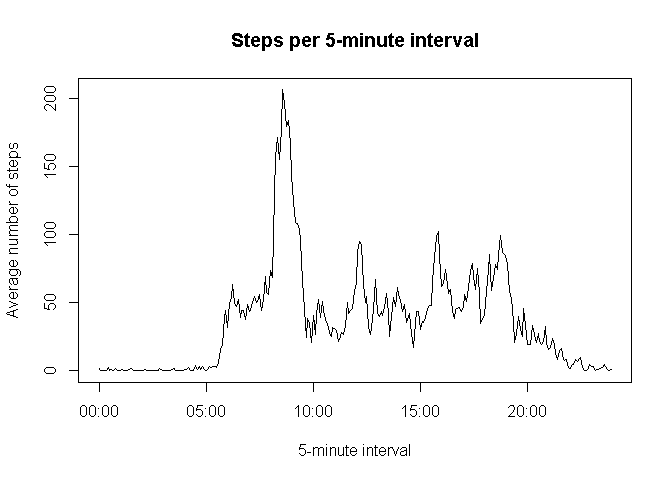

# Reproducible Research: Peer Assessment 1

This is an analysis of data collected through a personal activity monitoring device which collects data at 5 minute intervals through out the day. The dataset consists of two months of data from an anonymous individual collected during the months of October and November, 2012, and include the number of steps taken in 5 minute intervals each day.


```r
Sys.setlocale("LC_TIME", "English")
```

```
## [1] "English_United States.1252"
```

```r
sessionInfo()
```

```
## R version 3.1.3 (2015-03-09)
## Platform: x86_64-w64-mingw32/x64 (64-bit)
## Running under: Windows 7 x64 (build 7601) Service Pack 1
## 
## locale:
## [1] LC_COLLATE=French_France.1252      LC_CTYPE=French_France.1252       
## [3] LC_MONETARY=French_France.1252     LC_NUMERIC=C                      
## [5] LC_TIME=English_United States.1252
## 
## attached base packages:
## [1] stats     graphics  grDevices utils     datasets  methods   base     
## 
## loaded via a namespace (and not attached):
## [1] digest_0.6.8    evaluate_0.7    formatR_1.2     htmltools_0.2.6
## [5] knitr_1.10      rmarkdown_0.5.1 stringr_0.6.2   tools_3.1.3    
## [9] yaml_2.1.13
```


```r
# Set global options
knitr::opts_chunk$set(echo = TRUE)

# Utility function
  # Author: Steven Worthington
  # Source: https://gist.github.com/stevenworthington/3178163
  # Install, if necessary, and load multiple R packages
  # Check to see if packages are installed
  # Install them if they are not, then load them into the R session
ipak <- function(pkg){
    new.pkg <- pkg[!(pkg %in% installed.packages()[, "Package"])]
    if (length(new.pkg)) {
        install.packages(new.pkg, dependencies = TRUE)
    }
    sapply(pkg, require, character.only = TRUE)
}

# This script requires the `dplyr`, `lubridate`, and `lattice` packages
packages <- c("dplyr", "lubridate", "lattice")
ipak(packages)
```

```
##     dplyr lubridate   lattice 
##      TRUE      TRUE      TRUE
```

## Loading and preprocessing the data

Unzip and load the data.

```r
unzip("./activity.zip")
activity <- read.csv("activity.csv", header = T,
                     colClasses = c("numeric", "Date", "character"))
```

Convert the `interval` variable to a `HH:MM` string format.

```r
# activity$interval_nchar <- sapply(activity$interval, nchar)
# for (i in 1:nrow(activity)) {
#     if (activity[i, 'interval_nchar'] == 1) {
#         activity[i, 'interval'] <- paste0("00:0", activity[i, 'interval'])
#     } else if (activity[i, 'interval_nchar'] == 2) {
#         activity[i, 'interval'] <- paste0("00:", activity[i, 'interval'])
#     } else if (activity[i, 'interval_nchar'] == 3) {
#         activity[i, 'interval'] <- paste0("0",
#                                           substr(activity[i, 'interval'], 1, 1),
#                                           ":",
#                                           substr(activity[i, 'interval'], 2, 3))
#     } else {
#         activity[i, 'interval'] <- paste0(substr(activity[i, 'interval'], 1, 2),
#                                           ":",
#                                           substr(activity[i, 'interval'], 3, 4))
#     }
# }
# activity <- activity[, -4]
# str(activity)

activity$interval <- as.numeric(activity$interval)
activity$interval <- paste(floor(activity$interval / 100), activity$interval %% 100, sep = ":")
str(activity)
```

```
## 'data.frame':	17568 obs. of  3 variables:
##  $ steps   : num  NA NA NA NA NA NA NA NA NA NA ...
##  $ date    : Date, format: "2012-10-01" "2012-10-01" ...
##  $ interval: chr  "0:0" "0:5" "0:10" "0:15" ...
```

## What is the mean total number of steps taken per day?

To answer this question we will first remove the missing values from the dataset.


```r
completeactivity <- na.omit(activity)
```

Let's now compute the total number of steps taken each day.


```r
stepsperday <- completeactivity %>%
    group_by(date) %>%
    summarise(totalsteps = sum(steps))
```

We'll now look at a histogram of the total number of steps taken each day.

```r
hist(stepsperday$totalsteps, main = "Total number of steps taken each day",
     xlab = "Number of steps", breaks = 10, col = "lightskyblue")
```

 

Finally, we compute the average and the median number of steps taken per day.

```r
mean(stepsperday$totalsteps)
```

```
## [1] 10766.19
```

```r
median(stepsperday$totalsteps)
```

```
## [1] 10765
```

## What is the average daily activity pattern?

Let us first compute the average number of steps taken in each 5-minute interval, averaged across all days.


```r
stepsperinterval <- completeactivity %>%
    group_by(interval) %>%
    summarise(avgsteps = mean(steps))
```

We'll now make a time series plot of the 5-minute interval and the average number of steps taken, averaged across all days.


```r
stepsperinterval$time <- strptime(stepsperinterval$interval, "%H:%M")
# Order observations chronologically
stepsperinterval <- stepsperinterval[order(stepsperinterval$time), ]

with(stepsperinterval, plot(time, avgsteps, type = "l", xlab = "5-minute interval", ylab = "Average number of steps", main = "Steps per 5-minute interval"))
```

 

Finally, we'll find the interval having the maximum number of steps.

```r
maxsteps <- which.max(stepsperinterval$avgsteps)
stepsperinterval[maxsteps, 'interval'][[1]]
```

```
## [1] "8:35"
```

## Imputing missing values

Let's calculate the total number of missing values in the dataset (i.e. the total number of rows with NAs).


```r
nrow(activity[is.na(activity$steps), ])
```

```
## [1] 2304
```

Now we will create a new dataset that is equal to the original dataset but with the missing data filled in. We will use the mean for an interval to fill in missing values for that interval (the mean was computed earlier in the `stepsperinterval` data frame).


```r
naimputedactivity <- activity
for (i in 1:nrow(naimputedactivity)) {
    if (is.na(naimputedactivity$steps[i])) {
        intervaltoimpute <- naimputedactivity$interval[i]
        naimputedactivity$steps[i] <-
            stepsperinterval[stepsperinterval$interval == intervaltoimpute,
                             'avgsteps'][[1]]
    }
}
head(naimputedactivity, 10)
```

```
##        steps       date interval
## 1  1.7169811 2012-10-01      0:0
## 2  0.3396226 2012-10-01      0:5
## 3  0.1320755 2012-10-01     0:10
## 4  0.1509434 2012-10-01     0:15
## 5  0.0754717 2012-10-01     0:20
## 6  2.0943396 2012-10-01     0:25
## 7  0.5283019 2012-10-01     0:30
## 8  0.8679245 2012-10-01     0:35
## 9  0.0000000 2012-10-01     0:40
## 10 1.4716981 2012-10-01     0:45
```

We will now calculate again the total number of steps taken each day.


```r
stepsperday2 <- naimputedactivity %>%
    group_by(date) %>%
    summarise(totalsteps = sum(steps))
```

Let's look at a histogram of the total number of steps taken each day.

```r
hist(stepsperday2$totalsteps, main = "Total number of steps taken each day", xlab = "Number of steps", breaks = 10, col = "lightskyblue")
```

 

Compute the average and the median number of steps taken per day

```r
mean(stepsperday2$totalsteps)
```

```
## [1] 10766.19
```

```r
median(stepsperday2$totalsteps)
```

```
## [1] 10766.19
```

We can appreciate that the total number of steps per day follows a distribution which is roughly similar in form to the one of the number of steps where missing values were ignored. The frequencies have nevertheless gone up as a result of imputing missing values using the average value for each interval.

## Are there differences in activity patterns between weekdays and weekends?

We will use the dataset with the filled-in missing values to answer this question. We will first create a new factor variable in the dataset with two levels ("weekday" and "weekend") indicating whether a given date is a weekday or weekend day.


```r
naimputedactivity$day <- weekdays(naimputedactivity$date)
for (i in 1:nrow(naimputedactivity)) {
    if (naimputedactivity$day[i] == "Saturday"
        || naimputedactivity$day[i] == "Sunday") {
        naimputedactivity$day[i] <- "weekend"
    } else {
        naimputedactivity$day[i] <- "weekday"
    }
}
```

Let's now have a look at weekday and weekend activity patterns. We will first calculate again (this time with missing values imputed as shown above) the average number of steps taken during each 5-minute interval, averaged across all weekdays/weekend days.


```r
stepsperinterval2 <- naimputedactivity %>%
    group_by(day, interval) %>%
    summarise(avgsteps = mean(steps))

stepsperinterval2$time <- strptime(stepsperinterval2$interval, "%H:%M")
stepsperinterval2$time <- as.POSIXct(stepsperinterval2$time)
stepsperinterval2 <- stepsperinterval2[order(stepsperinterval2$time), ]
```

It's time to compare now the time series for weekdays and weekends.


```r
xyplot(avgsteps ~ time | day, data = stepsperinterval2, type = "l", layout = c(1, 2),
       xlab = "Interval", ylab = "Average number of steps",
       main = "Weekday vs weekend activity")
```

 

Overall, the shapes are not too dissimilar (the global peak occurs roughly at the same time interval), although the rate of activity appears to be somewhat more consistent at weekends than during weekdays, with a lower global peak.

